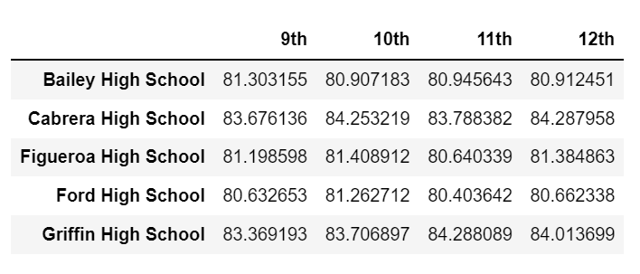

# School_District_Analysis

## Overview of School District Analysis 

Software's used Python, Pandas, CSV files & creating Data Frames. 

## Purpose 

Client was told academic dishonesty accured during standardized testing, at Thomas High. By replacing the math and reading scores of all 9th graders with NaN's, I was able to restore academic honesty. In doing so, this provides the data to stay intact and determine any changes to the overall analysis. 

## Results 

Using the Loc method, 9th graders math and reading scores from Thomas High, were changed to NaN. 

## - Differences amongst District Summary 

### Before 

### After 

## - Differences amongst School Summary 

### Before 

### After 

## - Thomas High Schools Perfomrance compared to other schools, after replacing 9th graders math and reading scores. 

### Before 

### After 

## - Math and reading scores by grade 

### Before (math)

### After (math)

### Before (reading)

### After (reading)

## - Scores by school spending 

### Before 

### After 

## - Scores by school size 

### Before 

### After 

## - Scores by school type 

### Before 

### After 

## Summary 

The changes made in both math and reading scores were: percentages, averages, overall passing. 
However, Thomas High's ranking amongst other schools remained the same.  
